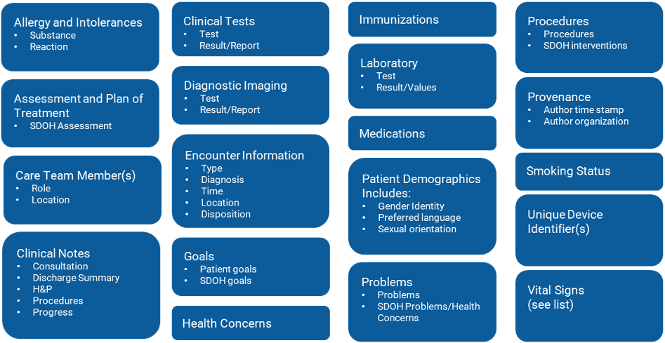

# Introduction to semantic interoperability; Top-level ontologies for the US domain

This chapter provides references and resources for learning more about the state of interoperability in the United States. It is not meant to be comprehensive, but should provide the workshop attendee with the requisite background to find out what is being done, by whom, and where to go to learn more. 

## Learning Healthcare System

* [Institute of Medicine (US) Roundtable on Evidence-Based Medicine, Olsen L, Aisner D, McGinnis JM, eds. The Learning Healthcare System: Workshop Summary. Washington (DC): National Academies Press (US); 2007.](https://pubmed.ncbi.nlm.nih.gov/21452449/)

## US Core Data for Interoperability 

```{r uscdi, fig.cap='USCDI v2',echo=FALSE, out.width='100%', fig.align='center'}

```

* [US Core Data for Interoperability v2](https:\\healthit.gov/isa/uscdi-data-class)

## Fast Healthcare Interoperability Resources (FHIR)

* [Lehmann HP, Downs SM. Desiderata for sharable computable biomedical knowledge for learning health systems. Learn Health Syst. 2018;2(4):e10065. https://onlinelibrary.wiley.com/doi/full/10.1002/ lrh2.10065.](https://onlinelibrary.wiley.com/doi/full/10.1002/ lrh2.10065)

* [USCDI FHIR Implementation Guide](https://www.hl7.org/fhir/us/core/index.html )

  * [Condition Profile](https://www.hl7.org/fhir/us/core/StructureDefinition-us-core-condition.html#notes)

  * [Laboratory Results Reporting](https://www.hl7.org/fhir/us/core/StructureDefinition-us-core-observation-lab.html#mandatory-search-parameters)

  * [Vital Sign Profile](https://www.hl7.org/fhir/us/core/StructureDefinition-us-core-blood-pressure.html#mandatory-search-parameters)

  * [Medication Profile](https://www.hl7.org/fhir/us/core/StructureDefinition-us-core-medication.html)

  * [MedicationRequest Profile](https://www.hl7.org/fhir/us/core/StructureDefinition-us-core-medicationrequest.html)

## Common Data Models

* [The National Patient-Centered Clinical Research Network (PCORnet)](https://pcornet.org/)

  * [PCORnet Common Data Model v6.0](https://pcornet.org/wp-content/uploads/2022/01/PCORnet-Common-Data-Model-v60-2020_10_221.pdf)
  
* [Observational Health Data Sciences and Informatics (OHDSI)](https://www.ohdsi.org/)
  * [The Book of OHDSI](https://ohdsi.github.io/TheBookOfOhdsi/)
  * [OMOP Common Data Model v5.3](https://ohdsi.github.io/CommonDataModel/cdm53.html)

