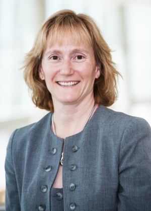
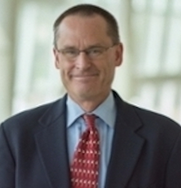

--- 
title: "Managing Interoperability of Healthcare Data for Decision Analytics and Research"
author: "James R. Campbell, MD; James C. McClay, MD, MS; Carol R. Geary, PhD, RN, MBA; W. Scott Campbell, PhD; A. Jerrod Anzalone, MS"
date: "Tuesday, May 24, 2022 8:00 AM - 12:30 PM CDT"
site: bookdown::bookdown_site
documentclass: journal
bibliography: [book.bib, packages.bib]
# url: your book url like https://bookdown.org/yihui/bookdown
# cover-image: path to the social sharing image like images/cover.jpg
description: |
  This pamphlet provides background information, references, and documentation
  for materials covered in this workshop.
link-citations: yes
github-repo: rstudio/bookdown-demo
---

Abstract
==================

This four-hour workshop for the advanced participant will promote interoperability and analytics in healthcare datamarts being developed and implemented for decision support, research and public health. It will guide the participant in implementing the guidelines of the ONC Interoperability Standards Advisory(ISA). The workshop team will employ their research and experience with HL7 and SNOMED CT to demonstrate the integration of SNOMED CT, LOINC and RxNORM as domain ontologies integrated with FHIR resources. Using a series of use cases taken from implementation of research network datamarts, they will present and discuss the relevant ISA specifications, and the associated ontology standards, some being developed at Nebraska. For each use case they will highlight any ambiguities in the ONC specifications and discuss the decisions to be made relative to deploying the semantics of the reference domain standards. They will present resources for managing and implementing relevant ONC sanctioned ontologies within the ISA model, including an integrated ontology of SNOMED-LOINC-RXNORM developed and published as terminology resources by Nebraska. Special attention will be focused on addressing problem areas of translational research that require integration of reference domain standards to bridge laboratory medicine, pathology, microbiology, genomics and patient phenomics. Each use case will be accompanied by demonstration of the data analytic utility of ontologies for extraction of meaningful knowledge from the EHR. Participants will conclude the workshop with an understanding of and access to a set of open source resources and tools for binding, integrating and maintaining the ontologies at their own institutions.

Learning Objectives
------------------

After participating in this session the learner should be better able to:

* Describe and discuss features of an interoperable data model compliant with the 2021 ONC Interoperability Standards Advisory for EHR core data domains

* Understand the semantic scope, strengths and weaknesses and tooling for terminology standards: SNOMED CT, LOINC, RxNorm, NDC, (CPT-4, ICD-10-CM/PCS, CVX)

* Identify and manage knowledge gaps present in domain ontologies in support logical integration of ontologies

* List resources and tools of use in deploying, maintaining and updating ONC interoperability standards


About the Presenters
------------------

**James R. Campbell, MD**

DESCRIPTION

```{r jrc, fig.cap='James R. Campbell',echo=FALSE, out.width='50%', fig.align='center'}

```


**James C. McClay, MD, MS**

James McClay, MD, MS, has over thirty years of clinical, informatics, and research experience as an Emergency Physician. He recently became the Chief Research Informatics Officer at the University of Missouri. Prior to this role, he was principal investigator for the University of Nebraska Clinical Research Analytics Environment (CRANE), director of the Great Plains IDeA Clinical and Translational Research Center Biomedical Informatics Core, and chaired the University of Nebraska Medical Center (UNMC) Biomedical Informatics Graduate Degree Program. His work focused on developing and operationalizing evidence generation pipelines for learning health systems. Dr. McClay is a long-standing Health Level Seven (HL7) participant as a workgroup chair and a clinical leader in the development of FHIR specifications.

```{r jcm, fig.cap='James C. McClay',echo=FALSE, out.width='50%', fig.align='center'}

```
**Carol R. Geary, PhD, RN, MBA**

Carol Geary, PhD, RN, MBA, is a nurse researcher who began her focus on use of structured electronic health record research during postdoctoral study with Dr. McClay. She spends much of her time focused on developing and instituting infrastructure necessary to support such usage. She has recently become the UNMC PCORnet Principal Investigator, building upon previous experience as Patient Engagement Officer. In this context, she aims to enhance availability and usability of structured electronic health data in nursing research.

```{r crg, fig.cap='Carol R. Geary',echo=FALSE, out.width='50%', fig.align='center'}

```

W. Scott Campbell, PhD

Scott Campbell, PhD, MBA is a tenured, associate professor in the Department of Pathology and Microbiology at the University of Nebraska Medical Center (UNMC) in Omaha, Nebraska, USA.  He is also the Director of Informatics for the Nebraska Public Health Laboratory and the Sr. Director of Research Information Technologies for UNMC. Dr. Campbell specializes in clinical informatics with special emphasis in cancer pathology and microbiology.      

The development of SNOMED CT concept expressions for use in cancer synoptic reporting which includes biomarker and next generation sequencing data comprises significant aspects of Dr. Campbell’s research efforts. He currently serves as the Chair of the Cancer Synoptic Reporting Working Group for SNOMED International which is creating the necessary knowledge representation and concepts for the SNOMED CT international release for use in structured cancer reporting. 

```{r wsc, fig.cap='W. Scott Campbell',echo=FALSE, out.width='50%', fig.align='center'}

```

A. Jerrod Anzalone, MS

Jerrod Anzalone, MS, is a PhD candidate in biomedical informatics and works as a clinical research informatics specialist for the University of Nebraska Medical Center (UNMC). His research interests are in applied clinical informatics, the secondary analysis of healthcare data for research, and the maintenance of medical terminology.. Over the past two years, he has worked heavily in the National COVID Cohort Collaborative (N3C), focusing on rural populations, immunosuppresed/compromised persons, and data quality issues in multi-center studies.

```{r aja, fig.cap='A. Jerrod Anzalone',echo=FALSE, out.width='50%', fig.align='center'}

```

## Learn More

To learn more about the work done by this research team on terminology development, please visit: 

* [Nebraska Lexicon](https://www.unmc.edu/pathology-research/bioinformatics/campbell/tdc.html)

* [University of Nebraska Medical Center's Clinical Research Analytics Environment GitHub](https://github.com/UNMC-CRANE)

```{r eval=FALSE}
bookdown::serve_book()
```


```{r include=FALSE}
# automatically create a bib database for R packages
knitr::write_bib(c(
  .packages(), 'bookdown', 'knitr', 'rmarkdown'
), 'packages.bib')
```
